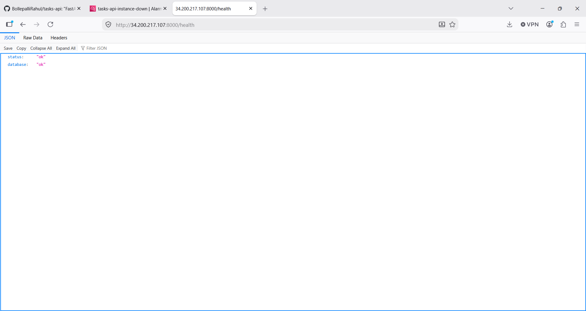
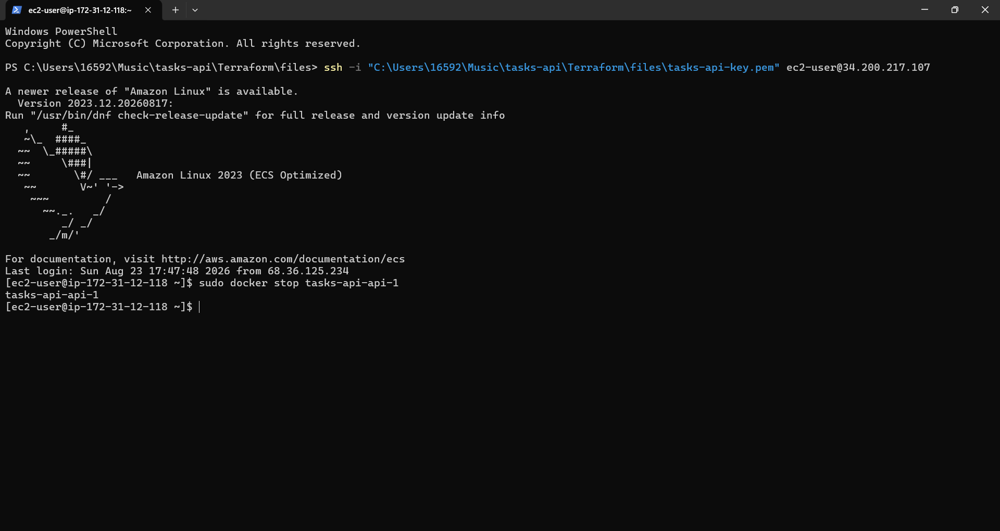
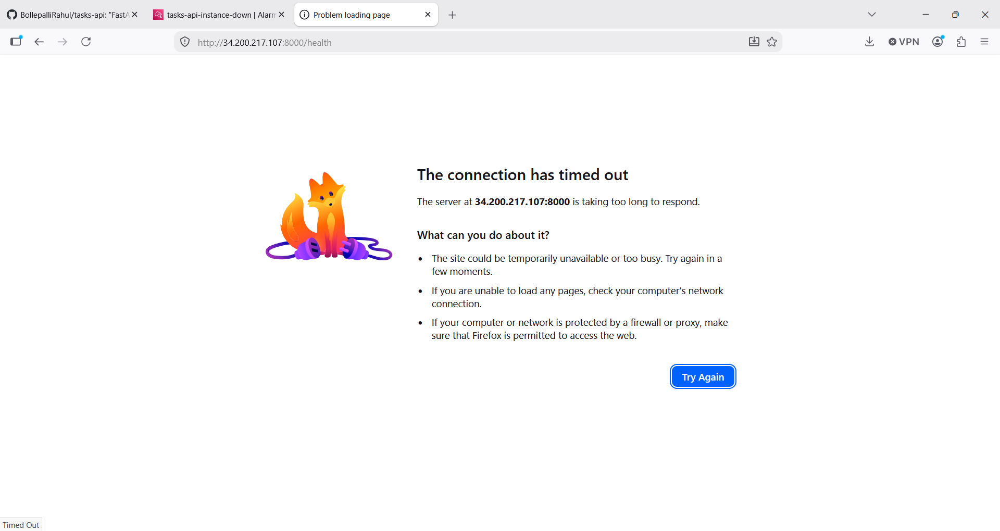
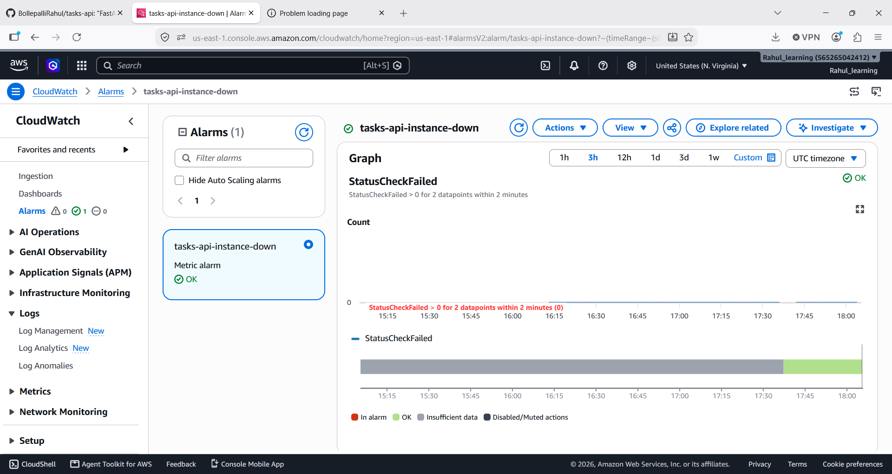
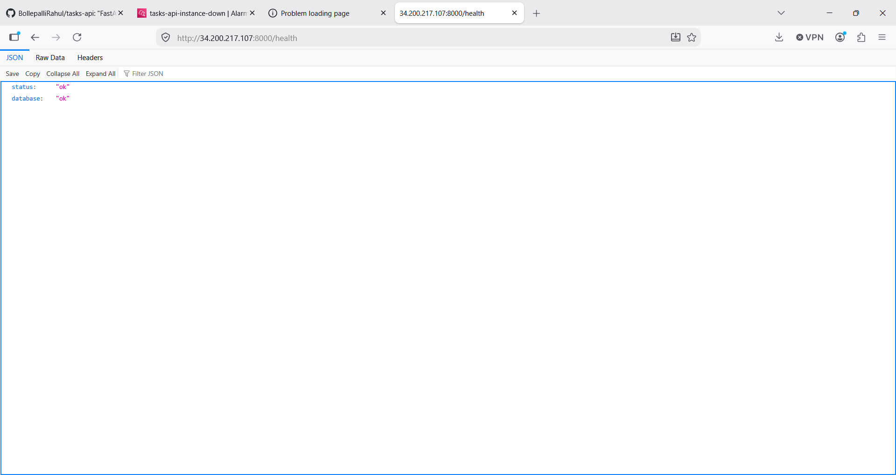

# Incident Report: tasks-api Container Outage

**Date:** August 23, 2026
**Duration:** ~2 minutes (deliberate, self-inflicted for training purposes)
**Severity:** Low (planned exercise, no real users affected)
**Status:** Resolved

---

## Summary

The `tasks-api` FastAPI container was deliberately stopped on the production EC2 instance to test the deployed monitoring setup. The application became fully unreachable (`GET /health` timed out), while the underlying EC2 instance continued reporting healthy the entire time. **The CloudWatch alarm did not fire**, because it only monitors instance-level health (`StatusCheckFailed`), not application-level health. This is the key finding of the exercise.

---

## Timeline

| Time (UTC) | Event |
|---|---|
| T+0:00 | Baseline confirmed: `GET /health` returns `{"status":"ok","database":"ok"}` |
| T+0:30 | Ran `sudo docker stop tasks-api-api-1` on the EC2 instance |
| T+0:35 | Browser request to `/health` times out ("connection has timed out") |
| T+1:00 | Checked CloudWatch alarm `tasks-api-instance-down` — status: **OK** (not triggered) |
| T+1:30 | Ran `sudo docker start tasks-api-api-1` to restore service |
| T+1:45 | Confirmed recovery: `GET /health` returns `{"status":"ok","database":"ok"}` |

---

## What happened

1. **Baseline** — the app was healthy and responding normally.

   

2. **Fault injected** — the API container was stopped directly on the server, simulating an application crash while leaving the host machine untouched.

   

3. **Impact observed** — the app became completely unreachable from outside.

   

4. **Monitoring checked** — despite the app being fully down, the CloudWatch alarm remained green.

   

5. **Recovery** — restarting the container immediately restored service.

   

---

## Root cause

The outage itself had a trivial, intentional cause (a manually stopped container). The more important finding is a **detection gap**:

- The `tasks-api-instance-down` CloudWatch alarm is built on the AWS-provided `StatusCheckFailed` metric, which only reflects whether the **EC2 instance** is running and reachable at the OS/network level.
- It has no visibility into what's happening **inside** the containers running on that instance.
- Because the EC2 instance itself never stopped responding, the alarm never had a reason to trigger — even though the actual service (the API) was completely down for the full outage window.

In other words: **the infrastructure was healthy, but the product was not** — and the current monitoring can't tell the difference.

---

## Fix applied

- Restarted the container manually: `sudo docker start tasks-api-api-1`
- Confirmed recovery via both `curl` on the server and a browser request from outside AWS

This resolved the immediate outage but does not address the underlying detection gap.

---

## Follow-up actions (runbook for next time)

1. **Add an application-level health check alarm**, not just an instance-level one — e.g., a scheduled Lambda or CloudWatch Synthetics canary that actually calls `GET /health` on a timer and alarms on non-200 responses or timeouts. This is the single highest-value fix, since it would have caught this exact outage in under a minute.
2. **Add a container-restart policy check** — `docker-compose.yml` already sets `restart: unless-stopped`, but that only protects against crashes, not an intentional/accidental `docker stop`. Worth deciding if that's the desired behavior long-term.
3. **Document this gap in the README** — so anyone reviewing the project (including a hiring manager) can see this was identified and understood, not missed.
4. **Consider adding basic alerting on the container level** too, e.g. shipping `docker events` or container exit codes to CloudWatch Logs, so "container stopped" shows up as a log entry even before/instead of a full HTTP-level check.

---

## What this exercise showed

Two infrastructure layers were verified independently:

- **The server layer worked as designed** — CloudWatch correctly reported the EC2 instance as healthy throughout, because it was.
- **The application layer had no equivalent check** — nothing was watching whether the actual product (the API) was usable by a real client.

This is a common and realistic gap in early-stage monitoring setups: it's easy to monitor "is the server on" and forget to monitor "does the service actually work." Catching this now, in a low-stakes deliberate test, is exactly what this exercise was for.
